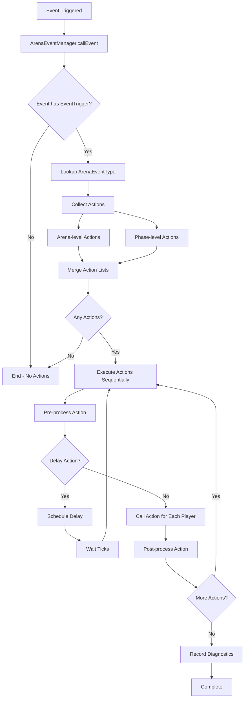

# BattleArena Architecture

## Overview

BattleArena is a comprehensive match and event framework for Minecraft built on Paper. It provides a flexible system for creating custom game modes, events, and competitions through configuration files or programmatic extensions.

## Core Components

### Plugin Structure

```
org.clockworx.battlearena/
├── BattleArena.java          # Main plugin class
├── Arena.java                 # Base arena/gamemode class
├── ArenaPlayer.java           # Player wrapper for competitions
├── competition/               # Competition system
│   ├── Competition.java      # Base competition interface
│   ├── LiveCompetition.java  # Server-side competition implementation
│   ├── PlayerStorage.java    # In-memory player data storage
│   └── ...
├── storage/                   # Persistence layer
│   ├── StorageManager.java   # Storage provider manager
│   ├── StorageAdapter.java   # Bridge between PlayerStorage and persistence
│   ├── StorageProvider.java  # Storage backend interface
│   ├── PlayerSave.java       # Serializable player data model
│   ├── FlatFileStorageProvider.java
│   ├── SQLiteStorageProvider.java
│   └── MySQLStorageProvider.java
└── ...
```

## Storage System Architecture

### Data Flow

The storage system provides a bridge between in-memory player data (`PlayerStorage`) and persistent storage backends.

```
┌─────────────────┐
│  ArenaPlayer   │
│   (created)     │
└────────┬────────┘
         │
         ▼
┌─────────────────┐      ┌──────────────────┐
│ PlayerStorage   │◄─────│ StorageAdapter    │
│  (in-memory)    │      │   (bridge)        │
└────────┬────────┘      └────────┬─────────┘
         │                         │
         │ store()                 │ persist()
         │                         │
         ▼                         ▼
┌─────────────────┐      ┌──────────────────┐
│  Data Stored    │      │ StorageManager   │
│  in Memory      │      │  (coordinator)   │
└─────────────────┘      └────────┬─────────┘
                                  │
                    ┌─────────────┼─────────────┐
                    ▼             ▼             ▼
          ┌──────────────┐ ┌──────────────┐ ┌──────────────┐
          │   FlatFile   │ │   SQLite     │ │    MySQL     │
          │  (YAML)      │ │  (embedded)  │ │  (network)   │
          └──────────────┘ └──────────────┘ └──────────────┘
```

### Storage Layers

1. **PlayerStorage** (In-Memory)
   - Stores player data during active competitions
   - Fast, temporary storage for game state
   - Automatically cleared when player leaves

2. **StorageAdapter** (Bridge)
   - Converts between `PlayerStorage` and `PlayerSave` formats
   - Handles serialization using Paper APIs
   - Manages async operations

3. **StorageManager** (Coordinator)
   - Manages storage provider lifecycle
   - Selects appropriate provider based on configuration
   - Provides unified interface for storage operations

4. **StorageProvider** (Backend)
   - Interface for storage backends
   - Implementations: FlatFile, SQLite, MySQL
   - Handles actual persistence operations

### Persistence Flow

1. **On Player Join Competition**:
   - `ArenaPlayer` is created
   - `StorageAdapter.load()` is called asynchronously
   - Persisted data is loaded and applied to `PlayerStorage`

2. **During Competition**:
   - `PlayerStorage.store()` is called when storing player state
   - `StorageAdapter.persist()` is called asynchronously
   - Data is saved to configured storage backend

3. **On Player Disconnect**:
   - `CompetitionListener.onQuit()` is triggered
   - Data is persisted synchronously (blocking) to ensure it's saved
   - Player is marked as disconnected

### Storage Backends

#### FlatFile (YAML)
- **Use Case**: Single-server setups, simple deployments
- **Storage**: YAML files in `saves/players/` directory
- **Pros**: Easy to backup, human-readable, no dependencies
- **Cons**: Slower for large player counts, not suitable for multi-server

#### SQLite
- **Use Case**: Single-server setups requiring better performance
- **Storage**: Embedded SQLite database file
- **Pros**: Fast, ACID-compliant, no external dependencies
- **Cons**: Not suitable for multi-server networks

#### MySQL/MariaDB
- **Use Case**: Multi-server networks (BungeeCord/Velocity)
- **Storage**: Network database server
- **Pros**: Shared data across servers, scalable, external tool access
- **Cons**: Requires database server setup, network dependency

## Competition System

### Competition Lifecycle

1. **Creation**: Competition is created from an `Arena` configuration
2. **Waiting Phase**: Players can join, waiting for start conditions
3. **Active Phase**: Game is in progress
4. **Victory Phase**: Game ends, winners determined
5. **Cleanup**: Competition is removed, players restored

### Player Storage During Competition

- Player data is stored when joining competition
- Data is restored when leaving competition
- Disconnected players have data persisted for rejoin

## Event System

BattleArena uses an event-driven architecture that allows configurable actions to be triggered when specific events occur during competitions. The event system provides a flexible way to customize game behavior without modifying code.

### Event System Components

- **`ArenaEvent`**: Base interface for all arena events
- **`ArenaEventType`**: Registry of available event types (e.g., `on-join`, `on-death`, `on-victory`)
- **`ArenaEventManager`**: Manages event processing and action execution
- **`EventAction`**: Base class for configurable actions
- **`ArenaEventHandler`**: Annotation for listening to arena-specific Bukkit events
- **`ArenaEventDiagnostics`**: Tracks event execution metrics and errors

### Event Processing Flow

When an event is triggered, the following flow occurs:



### Event Configuration

Events can be configured at two levels:

1. **Arena Level**: Defined in the root `events:` section of arena configuration
   - Applies to all competitions for that arena
   - Example: `events: on-join: [...]`

2. **Phase Level**: Defined in `phases:<phase-name>:events:` section
   - Applies only during that specific phase
   - Overrides arena-level events for the same event type
   - Example: `phases: ingame: events: on-start: [...]`

### Action Execution

Actions are executed in the order they appear in the configuration:

1. **Pre-processing**: `action.preProcess()` is called once globally
2. **Player Processing**: `action.call()` is called for each affected player
3. **Post-processing**: `action.postProcess()` is called once globally

The `delay` action pauses execution for a specified number of ticks before continuing with the next action.

### Event Types

#### Player Events
- `on-join`: Player joins competition
- `on-leave`: Player leaves competition
- `on-spectate`: Player enters spectator mode
- `on-death`: Player dies
- `on-kill`: Player kills another player
- `on-respawn`: Player respawns
- `on-life-deplete`: Player loses a life (has lives remaining)
- `on-lives-exhaust`: Player runs out of all lives
- `on-stat-change`: Player or team stat changes

#### Competition Events
- `on-start`: Competition phase starts
- `on-complete`: Competition phase completes
- `on-victory`: Players win competition
- `on-lose`: Players lose competition
- `on-draw`: Competition ends in a draw

### Resolver System

The resolver system provides dynamic placeholders for use in messages and commands:

- **Context Resolution**: Each event provides a `Resolver` with context-specific values
- **Placeholder Syntax**: Use `{placeholder-name}` in action parameters
- **Available Resolvers**: `player`, `killer`, `killed`, `arena`, `competition`, `map`, `team`, `lives-left`, `stat`, etc.

### Event Diagnostics

The `ArenaEventDiagnostics` system tracks:

- **Metrics**: Event trigger counts, actions executed, failures by phase
- **Error Tracking**: Last error per event type with full context (arena, action, phase, stacktrace)
- **Trace Logging**: Optional per-arena or per-event-type trace logging
- **Diagnostic Reports**: Generate reports via API for debugging

Diagnostics are automatically recorded when:
- Events are triggered
- Actions are executed successfully
- Pre-process, process, or post-process failures occur

### Event Action Types

Common action types include:

- **Player Management**: `store`, `restore`, `teleport`, `change-gamemode`, `change-role`
- **Inventory**: `clear-inventory`, `give-item`, `give-effects`, `clear-effects`
- **Communication**: `send-message`, `broadcast`, `play-sound`
- **Competition**: `leave`, `respawn`, `reset-state`, `join-random-team`
- **Control Flow**: `delay`, `run-command`, `kill-entities`, `teardown`

See the [Event System Reference](EVENTS.md) for complete documentation on all event types and actions.

## Module System

BattleArena supports modular extensions:
- Modules are loaded from `modules/` directory
- Can extend functionality without modifying core
- Examples: Vault integration, custom game modes

## Paper API Integration

BattleArena heavily uses Paper-specific APIs:
- **Brigadier Commands**: Native command registration
- **ItemStack Serialization**: `serializeAsBytes()` / `deserializeBytes()`
- **PersistentDataContainer**: Temporary data storage
- **Adventure Components**: Modern text system

## Threading Model

- **Main Thread**: All player interactions, game logic
- **Async Threads**: Storage operations, database queries
- **Scheduler**: Bukkit scheduler for delayed/repeating tasks

All storage operations are asynchronous to prevent blocking the main thread, with callbacks to apply changes on the main thread when needed.
